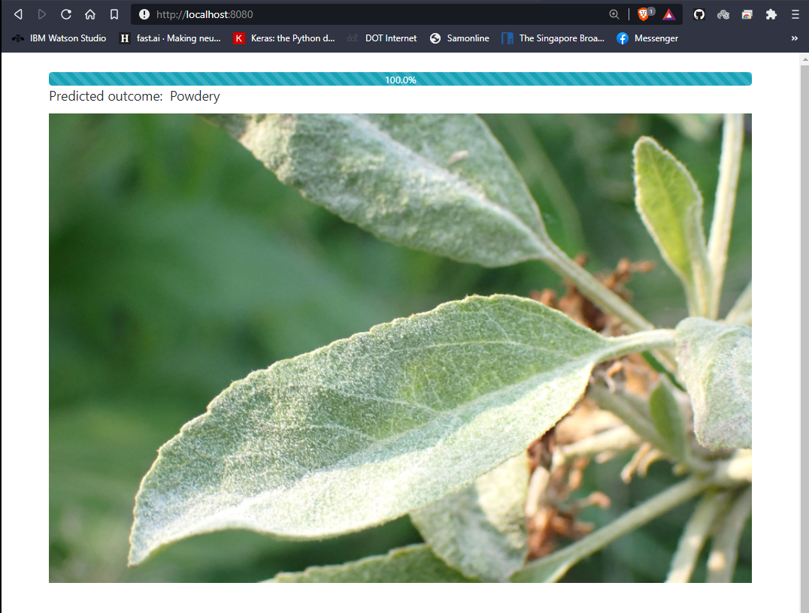

# Plant Pathology Detection FGVC8

This is a plant disease recognition project. I used a CNN to build the deep learning model for recognition and used PyWebIO & flask for a web end interface. Model accuracy is over 91% in classification report. Due to bandwidth issue couldn't upload the model.h5 file but hope to update it soon.

You need to locate to the directory where you clone this repo. You can use command promt
or anaconda powershell. To locate to repo you just need to type in this command. I am using Anaconda PowerShell. Run Anaconda PowerShell as administrator then paste the following commands.

```ini
cd 'path to repo'
```

Use the following command to install dependencies. 
 
 ```ini
pip install -r requirement.txt
```

Now to run the program use the following command {It will work after I uplod the model.h5 file}

```ini
python app.py
```
### Model performance 


### Web end interface 



